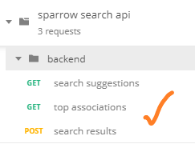

# Sparrow Search API Usage

> API文档及其它制品在 [sparrow/api-docs](.) 路径下

## 1.API文档

见 [search.html](./search.html)

## 2.API测试

### 2.1.启动Mock服务

使用[snowboard](https://github.com/bukalapak/snowboard)Mock数据。

> 好像我用[drakov](https://github.com/Aconex/drakov)会导致出错，而snowboard则没问题。

1. 使用npm安装snowboard

```bash
npm i -g snowboard
```

2. 启动snowboard mock服务

```bash
# dir: api-docs
snowboard mock search.apib -b localhost:8080
```

### 2.2.Postman测试脚本

1.将[sparrow search api.postman_collection.json](./sparrow search api.postman_collection.json)导入postman

> 如果导入出错，请升级postman版本


2. 创建测试环境 `elasticsearch` （命名随意），添加环境变量 `backend-url`


3. 使用脚本测试

