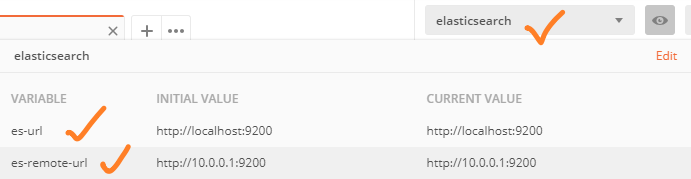
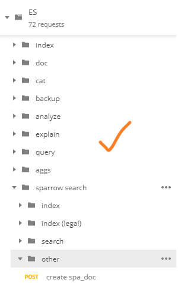
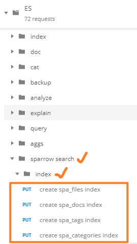
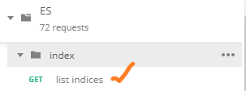
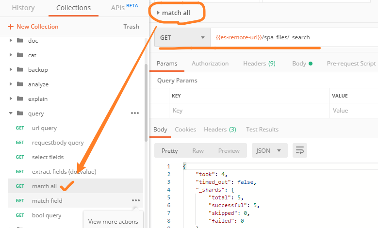

# Elasticsearch资料整理

## 1.资源链接

检索业务用到的核心技术是 [Elasticsearch](https://www.elastic.co/products/elasticsearch)，“一个分布式、RESTful 风格的搜索和数据分析引擎”。Elasticsearch相当于一个面向文档的NoSQL数据库。在Elasticsearch中，存储的最小单元被称为“文档
”（doc），数据以JSON格式存储，JSON对象每个字段内容（value）都可以被索引存储。

### 1.1.ES 官方文档

快速熟悉Elasticsearch（以下简称ES）的方式——阅读官方文档（**[★Elasticsearch官方文档：Elasticsearch Reference Guide](https://www.elastic.co/guide/en/elasticsearch/reference/current/index.html)**），以下列出**必读章节（强烈推荐）**：

| 官方文档链接                                                 | 简介                                   |
| ------------------------------------------------------------ | -------------------------------------- |
| ★[Elastic Stack and Product Documentation](https://www.elastic.co/guide/index.html) | Elastic技术栈文档目录                  |
| **★[Getting Started](https://www.elastic.co/guide/en/elasticsearch/reference/current/getting-started.html)** | 快速熟悉ES                             |
| [Document APIs](https://www.elastic.co/guide/en/elasticsearch/reference/current/docs.html) | 文档对象CRUD API                       |
| [Search APIs](<https://www.elastic.co/guide/en/elasticsearch/reference/current/search.html>) | 检索API                                |
| **★[Query DSL](<https://www.elastic.co/guide/en/elasticsearch/reference/current/query-dsl.html>)** | 检索查询语句的构造，支持丰富的查询方式 |
| [Mapping](<https://www.elastic.co/guide/en/elasticsearch/reference/current/mapping.html>) | 索引字段的映射，即meta的设计           |
| **★[Aggregations](https://www.elastic.co/guide/en/elasticsearch/reference/current/search-aggregations.html)** | ES聚集（ES最强大突出的特性之一）       |
| [Java Rest High Level Client](<https://www.elastic.co/guide/en/elasticsearch/client/java-rest/current/java-rest-high.html>) | Java API文档，ES查询语句 ⇨ Java代码    |
| [Analysis](https://www.elastic.co/guide/en/elasticsearch/reference/current/analysis.html) | 分词、索引                             |

掌握query与aggregation的特性，结合meta的设计，可满足大多数常见的功能性检索需求。

> 建议至少读完【Getting Started】部分的文档，再继续阅读本文剩余部分。

### 1.2.数据迁移工具

| 链接                                                         | 简介                           |
| ------------------------------------------------------------ | ------------------------------ |
| ★[Getting Started with Logstash](https://www.elastic.co/guide/en/logstash/current/getting-started-with-logstash.html) | Logstash：ES数据导入、迁移工具 |
| ★[elasticdump](https://github.com/taskrabbit/elasticsearch-dump) | ES数据（轻量）导入导出工具     |

### 1.3.检索原理与优化

| 链接                                                         | 简介                             |
| ------------------------------------------------------------ | -------------------------------- |
| [如何使用 Elasticsearch 6.2 搜索中文、日文和韩文文本](https://www.elastic.co/cn/blog/how-to-search-ch-jp-kr-part-1) | 分词器与多字段方法，增强搜索效果 |
| [Multi-fields](https://www.elastic.co/guide/en/elasticsearch/reference/current/multi-fields.html) | 多字段                           |
| [Indexing for Beginners](https://www.elastic.co/cn/blog/found-indexing-for-beginners-part3) | 存储与检索：分词、倒排索引       |
| [Similarity Module](https://www.elastic.co/guide/en/elasticsearch/reference/current/index-modules-similarity.html) | 匹配评分算法                     |
| [Highlighting](https://www.elastic.co/guide/en/elasticsearch/reference/current/search-request-highlighting.html#offsets-strategy) | 检索结果高亮                     |

### 1.4.检索Demo

| 链接                                                         | 简介                                                         |
| ------------------------------------------------------------ | ------------------------------------------------------------ |
| [SearchKit](https://github.com/searchkit/searchkit)<br/>[SearchKit Demo](http://demo.searchkit.co/) | 开源ES前端UI<br/>✓ 侧边栏<br/>✓ 图标模式 \| 列表模式 <br/>✓ 前端控件构造ES查询语句 |
| [51job职位搜索](https://search.51job.com/)                   | ✓ 过滤条件布局                                               |
| [淘宝](https://www.taobao.com/)                              | ✓ 搜索建议联动<br/>✓ 标签类目、过滤选项的布局                |
| [当当 高级搜索](http://search.dangdang.com/advsearch?is_batch=1) | ✓ 多字段搜索                                                 |

### 1.5.其它链接

| 链接                                                         | 简介                                                |
| ------------------------------------------------------------ | --------------------------------------------------- |
| [Awesome Elasticsearch](https://github.com/dzharii/awesome-elasticsearch) | ES资源汇总（文档、工具、开源项目）                  |
| [elasticsearch-definitive-guide](https://github.com/elastic/elasticsearch-definitive-guide) | ES较权威的书（停留在ES 2.0版本，目前ES已更新至7.2） |
| [Elasticsearch史上最全最常用工具清单](https://blog.csdn.net/laoyang360/article/details/80645710) | ES集群、运维工具                                    |

## 2.API测试

### 2.1.服务器ES环境

39.108.210.48服务器上部署有7.2.0版本的ES，端口号为9200，可使用Openvpn客户端连接到39服务器。具体方案见[【使用Openvpn客户端连接39服务器】](./使用Openvpn客户端连接39服务器.md)。

### 2.2.Postman测试

#### 2.2.1.导入Postman Collection

1. 将[ES.postman_collection.json](./ES.postman_collection.json)导入postman

> 如果导入出错，请升级postman版本（Postman v7.3.3）


2. 创建测试环境 `elasticsearch` （命名随意），添加环境变量 `es-url` 与 `es-remote-url`



3. 使用脚本测试



#### 2.2.2.导入测试数据

【注】39服务器上的ES中已存在这些数据，这一小节适用于本地ES。

将豆瓣图书数据导入到ES。

1. 安装nodejs环境，使用npm命令安装elasitcdump工具

* [nodejs（包含npm）](https://nodejs.org/en/)
* [elasticdump](https://github.com/taskrabbit/elasticsearch-dump)

```bash
# cmd / terminal
# desc: 使用npm命令安装elasitcdump工具
npm install -g elasticdump
```

2. 为ES安装smartcn插件：

   ```bash
   # cmd / terminal
   # dir: elasticsearch/bin/
   # desc: 使用 `elastic-plugin` 安装smartcn插件
   ./elasticsearch-plugin install analysis-smartcn
   ```

3. 使用Postman Collection： `ES/sparrow/index` 创建index



4. 使用elasticdump工具，将data目录下的测试数据导入ES

   > 留意命令行工作目录、Elasticsearch主机和端口号

   ```bash
   # cmd / terminal
   # dir: ES/data/
   elasticdump --input=spa_files.json --output=http://localhost:9200/spa_files
   elasticdump --input=spa_docs.json --output=http://localhost:9200/spa_docs
   elasticdump --input=spa_tags.json --output=http://localhost:9200/spa_tags
   elasticdump --input=spa_categories.json \
   			--output=http://localhost:9200/spa_categories
   ```

5. 检查索引状态



6. 查看数据格式

