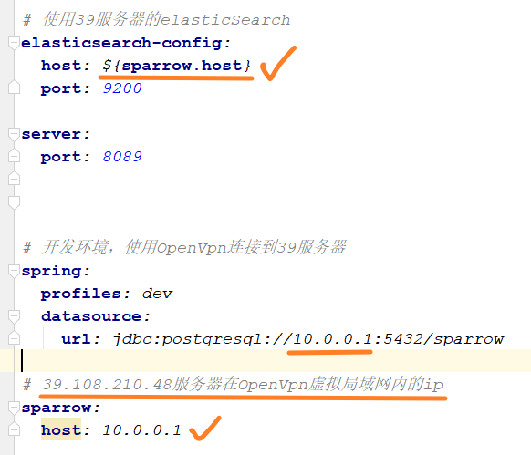

# 使用Openvpn客户端连接39服务器

39.108.210.48服务器上部署有Openvpn服务器，客户端只需安装Openvpn客户端和配置证书，便可连接到虚拟局域网中，访问服务器上部署的web应用（端口号连通）。

1. 安装 [Openvpn客户端](https://openvpn.net/) 
2. 将 `config-sparrow.zip` 解压至 `openvpn/config` 目录下；

3. 右键执行 `sparrow.ovpn` 即可

4. 输入密码 `sparrow2019` ，等待openvpn客户端连接服务器后，会自动分配到虚拟网络的ip
5. 服务器的虚拟ip为 <b style="color:red">10.0.0.1</b> ，命令行 `ping 10.0.0.1` ，如果成功连接，则可正常接收到数包

<b style="color:red">服务器虚拟ip为10.0.0.1</b>，之后在本机的开发环境上使用该ip地址便可访问到服务器的web应用和服务。

* 访问39.108.210.48服务器上的ES：

* 在spring boot应用的 `application.yml` 中使用服务器虚拟ip：

