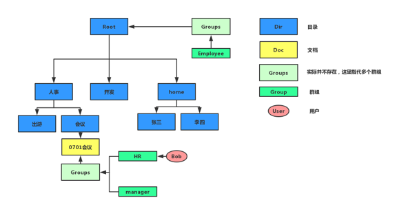

# Sparrow 目录&权限-技术方案

> 作者：郑铠锋

[TOC]

## 1. 术语

| 名称     | 解释                                                         |
| -------- | ------------------------------------------------------------ |
| User     | 系统用户，对应公司里的每位员                                 |
| Group    | 群组，一个用户可以属于多个群组，一个群组可以有多个用户，是多对多的关系 |
| SPA_File | 如jpg，txt，doc，mp4等具体文件，可上传/覆盖，下载，删除...... |
| SPA_Doc  | 文档，管理概念，可以看作对一组相关文件（file）的集中描述与管理 |
| SPA_Dir  | 目录，管理概念，用户可创建Unix-like的目录结构                |
| SPA_Path | 路径，如dep_a/pic（在Sparrow的目录语境中，SPA_Doc是Unix-like文件结点[1]） |

**[1]**：目录结构的叶子节点是文档，即目录下不可以直接挂载文件

## 2. 目录结构&权限体系

### 2.1 目录结构
#### 介绍
Sparrow系统在生产环境中应该具有多颗如上图所示的“树”。根节点为Root目录，home目录下是用户的个人工作区，用户登录系统时，会自动进入自己的个人工作区，用户可以在该工作区中进行文件的上传，下载等操作（类似网盘），而其他人不可进入该工作区。
上图中的人事，开发目录对应企业内的各个部门（称为部门根目录）。部门根目录、Root目录和home目录默认不可修改，仅系统管理员有权限进行修改。

#### 实现方案
将目录元数据存入业务数据库PostgreSQL中，使用外联表**master_slaves**存放目录的上下级关系，获取目录的下级目录时，只需将外联表和目录元数据表进行拼接返回即可。同时，利用PostgreSQL对递归查询的支持，可以快速定位当前目录的完整路径，以及获得目录下的所有资源（子资源，子孙资源）。

### 2.2 权限体系
#### 介绍
Sparrow系统使用基于群组的类unix-like权限体系。权限的赋予对象是群组，用户通过加入拥有指定资源权限的群组获得对资源的操作权限。用户对资源进行操作时，通过查看用户所在群组对资源是否有相应操作的权限即可进行权限鉴定。资源的权限有3种，可读、可写、可执行。可读意味着用户可以查看资源的元数据及资源的子资源（进入目录或进入文档）以及对文件的下载，预览。可写意味着用户可以修改资源元数据，删除资源，上传资源。可执行权限在当前Sparrow系统中并未真正派上用场，其使用场景为对IOT设备的控制（未来，文件实体可替换为物联网实体）。

上图中，用户Bob属于HR群组，该群组对文档“0701会议”有可读权限，于是Bob有以下操作权限：

* 查看文档“0701会议”元数据，进入文档
* 预览，下载文档内的文件
* 对”会议“，”人事“，”Root“目录的可读权限

#### 实现方案
根据Unix-like的文件权限系统，业务数据库中，可读为“100”，可写为“010”，可执行为“001”。用户进行操作时，只需判断某一位上的值是否为1即可。
用户登录时，为合法的用户生成登录Token并将用户的个人信息存放在Redis中，其中包括用户的唯一标识和群组列表等。用户在后续的访问中，后端服务器的Filter拦截请求，从Token中获取用户id，通过该id从Redis中获取用户的个人信息。获取成功说明用户为合法用户，并将用户信息存放到request的attribute中。请求通过过滤器后，在当前访问的上下文中，可随时获得用户个人信息。
凡是涉及到权限的访问，从用户个人信息中获取用户的群组列表，通过比对用户所在群组对指定资源的操作权限进行权限鉴别。
是csapp，软硬件接口

## 3. 核心技术：PostgreSQL
项目使用的业务数据库是[PostgreSQL](https://www.postgresql.org/)，“一个开源的对象关系型数据库系统”。相较于MySQL，PostgreSQL支持数据递归查询，能够快速定位当前目录或文档的完整路径。
### 3.1 PostgreSQL 官方文档
通过阅读官方文档([PostgreSQL Documentation](https://www.postgresql.org/docs/12/index.html))，可以快速熟悉PostgreSQL的SQL查询语句和特性，以下列出**必读章节**：

| 官方文档链接                                                 | 简介        |
| :----------------------------------------------------------- | ----------- |
| [PostgreSQL Syntax](https://www.postgresql.org/docs/12/sql-syntax.html) | SQL语法     |
| [PostgreSQL Data Type](https://www.postgresql.org/docs/12/datatype.html) | 数据类型    |
| [PostgreSQL queries](https://www.postgresql.org/docs/7.4/queries.html) | SQL查询语句 |

### 3.2 精选博客

这篇博客详细的介绍了PostgreSQL的递归查询：

| 博客链接                                                | 简介           |
| ------------------------------------------------------- | -------------- |
| [PostgreSQL Recursive](http://www.jasongj.com/sql/cte/) | PostgreSQL递归 |

