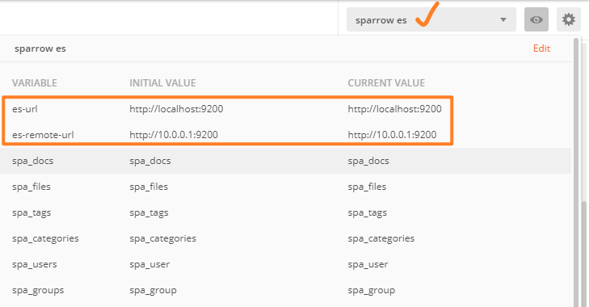
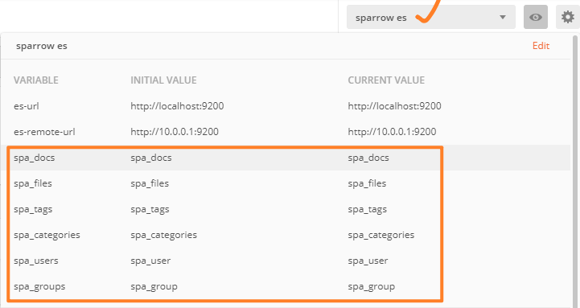
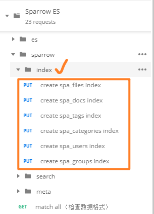
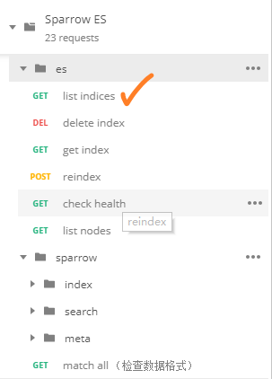
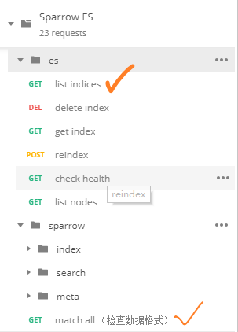

# Sparrow项目快速部署

> 作者：郑铠锋，陈绿佳，梁宏达，陈晓滨，李培文

[TOC]

## 1. 环境部署&数据准备
### 1.1 ES

#### 1.1.1 环境部署

##### 1.1.1.1 Elasticsearch 7.2.0

1. 官方安装文档：[Elasticsearch Reference 7.2.0 / Getting Started Installation](https://www.elastic.co/guide/en/elasticsearch/reference/7.2/getting-started-install.html)
2. 为ES安装smartcn中文分词插件：

```bash
# cmd / terminal
# dir: elasticsearch-7.2.0/bin/
# desc: 使用 `elastic-plugin` 安装smartcn插件
./elasticsearch-plugin install analysis-smartcn
```

##### 1.1.1.2 Postman测试运维脚本

0. 安装 [postman](https://www.getpostman.com/)

1. 将 [Sparrow ES.postman_collection.json](./ES.postman_collection.json) 导入postman

   > 如果导入出错，请升级postman版本（Postman v7.3.3）


2. 创建测试环境 `sparrow es` （命名随意）

   * 添加环境变量 `es-url` 与 `es-remote-url`

   > 请将 es-url 和 es-remote-url 修改为实际开发、生产环境中ES的ip地址与对应端口号

    

   * 添加sparrow索引的环境变量：

     > 请将具体命名相应地更改为实际开发、生产环境中索引的命名

     

##### *1.1.1.3 Logstash 7.2.0 [可选]

运维开发工具，用于ES数据导入、迁移：[Installing Logstash](https://www.elastic.co/guide/en/logstash/7.2/installing-logstash.html)

##### *1.1.1.4 Elasticdump [可选]

轻量级ES数据导入导出工具。

1. 安装 [nodejs环境](https://nodejs.org/en/)
2. 使用npm命令安装 [elasticdump工具](https://github.com/taskrabbit/elasticsearch-dump)

```bash
# cmd / terminal
# desc: 使用npm命令安装elasitcdump工具
npm install -g elasticdump
```

#### 1.1.2 数据准备

##### 1.1.2.1 创建索引映射

sparrow用以下6个索引存储相关Meta信息：

| 索引           | 简介            |
| -------------- | --------------- |
| spa_docs       | sparrow文档Meta |
| spa_files      | sparrow文件Meta |
| spa_tags       | 标签            |
| spa_categories | 类目            |
| spa_users      | 用户            |
| spa_groups     | 群组            |

> 相应的字段设计具体见 《ES Meta&检索-技术方案》

使用Postman： `Sparrow ES/sparrow/index` 创建索引映射。在实际生产环境中，可自定义索引名称，例如 `docs`, `files`, `tags` 等，或者 `legal_docs`, `legal_files`, `legal_tags` 等，使得最大限度利用1个物理上的Elasticsearch服务器。

> 注：如果缺失ES的smartcn插件，会抛出异常！



检查ES索引状态：



##### *1.1.2.1 迁移业务数据

创建索引后，sparrow系统初始化，没有数据。可以考虑从原有业务数据库中将Meta数据（文档、文件以及标签等）迁移到ES。这里以mysql为例，使用logstash将关系型数据迁移到ES。

> 有关logstash的更多资料：[Getting Started with Logstash](https://www.elastic.co/guide/en/logstash/current/getting-started-with-logstash.html)

1. 导入示例数据到mysql：

```bash
# 命令行登录mysql
> mysql -uroot -p123456

# 留意legal.sql所在目录
mysql > created database legal character set utf8mb4;
mysql > use legal;
mysql > source legal.sql;
```

示例数据库中表格信息与ES索引对应如下：

| mysql表格                    | 包含信息               | ES索引                       | logstash迁移配置文件 |
| ---------------------------- | ---------------------- | ---------------------------- | -------------------- |
| file_t                       | 文件Meta               | spa_files                    | spa_files.yml        |
| category_t                   | 类目                   | spa_categories               | spa_categories.yml   |
| keyword_t                    | 关键词                 | spa_tags                     | spa_tags.yml         |
| file_category_t              | 文件与类目的外联关系   | spa_files 的 categories 字段 | file_categories.yml  |
| file_keyword_t               | 文件与关键词的外联关系 | spa_files 的 tags 字段       | file_tags.yml        |
| keyword_t<br/>file_keyword_t | 关键词                 | spa_files 的 keywords 字段   | file_keywords.yml    |

2. 迁移文件Meta

从 mysql  `file_t` 表迁移数据到ES `spa_file` 索引，查询语句如下：

```mysql
select concat('image_', `id`) as `id`,
	concat('image_', `id`) as `original_id`,
	`title`,
	`desc`,
	`creator`,
	`content`,
	
	-- 转换时间格式
	date_format(str_to_date(`created_time`, '%Y/%m/%d %H:%i'), get_format(DATETIME, 'JIS')) as `created_time`,
	date_format(str_to_date(`modified_time`, '%Y/%m/%d %H:%i'), get_format(DATETIME, 'JIS')) as `modified_time`,

	'image' as `type`,
	CASE FLOOR(RAND() * 3)
		WHEN 0 THEN 'jpg'
		WHEN 1 THEN 'png'
		WHEN 2 THEN 'gif'
	END as `ext`,

	-- 赋予字段初始值（也可省略这些字段）
	1024 as `size`, 
	NULL as `store_key`,
	NULL as `thumbnail`, 
	NULL as `derived_files`,
	NULL as `doc_id`,
	0 as `version`,
	NULL as `parent_id`
from `file_t`;
```

 `spa_files.yml` 配置文件中包含了以上查询语句，使用logstash迁移数据：

>  修改 `spa_files.yml` 文件中的数据库配置（用户名、密码、驱动等）、以及对应的ES索引

```bash
# dir: sparrow/doc/logstash/
# 可考虑将logstash添加到path环境变量
./logstash -f spa_files.yml
```

用类似的方法，将 `category_t` 与 `keyword_t` 分别迁移到 `spa_categories` 和 `spa_tags` 索引。

3. 迁移文件外联字段

从 mysql  `file_keyword_t` 表迁移标签id的数据到ES `spa_file` 索引，查询语句如下：

```mysql
SELECT concat('image_', F.id) as `id`, `keyword_id` as tag_id
FROM (select `id` from `file_t`) as F join `file_keyword_t` as FT on F.id = FT.file_id
order by F.id;
```

得到格式为 (`id`, `tag_id`) 的一条条记录，按 `id` 排序。

使用 `file_tags.yml` 配置文件迁移数据：

```bash
# dir: sparrow/doc/logstash/
# 使用单线程，保证同一id对应的多个tag_id能按次序收集到tags数组中
./logstash -f file_tags.yml -w 1
```

用类似的方法，迁移 `file_category_t` 的数据到 `spa_files` 的 `categories` 字段。

4. 迁移文件关键词

方法类似[3.迁移外联字段]

```mysql
SELECT concat('image_', F.id) as `id`, K.`title` as `keyword`
FROM (select `id` from `file_t`) as F 
	join `file_keyword_t` as FT on F.id = FT.file_id
	join `keyword_t` as K on FT.keyword_id = K.id
order by F.id;
```

```bash
# dir: sparrow/doc/logstash/
# 使用单线程，保证同一id对应的多个keyword能按次序收集到keywords数组中
./logstash -f file_keywords.yml -w 1
```

5. 检测索引状态与数据格式



##### *1.1.2.3 备份与恢复数据

**A.备份与恢复ES集群**

ES官方文档 [Back up a Cluster](https://www.elastic.co/guide/en/elasticsearch/reference/7.2/backup-cluster.html)

**B.备份与恢复少量数据**

使用elasticdump工具备份、恢复数据。

> 留意命令行工作目录、Elasticsearch主机和端口号

* 备份数据：

```bash
# cmd / terminal
# dir: 文件所在目录
elasticdump --output=spa_files.json --input=http://localhost:9200/spa_files
elasticdump --output=spa_docs.json --input=http://localhost:9200/spa_docs
elasticdump --output=spa_tags.json --input=http://localhost:9200/spa_tags
elasticdump --output=spa_categories.json --input=http://localhost:9200/spa_categories
```

* 恢复数据：

```bash
# cmd / terminal
# dir: 文件所在目录
elasticdump --input=spa_files.json --output=http://localhost:9200/spa_files
elasticdump --input=spa_docs.json --output=http://localhost:9200/spa_docs
elasticdump --input=spa_tags.json --output=http://localhost:9200/spa_tags
elasticdump --input=spa_categories.json --output=http://localhost:9200/spa_categories
```

### 1.2 PostgreSQL
#### 1.2.1 环境部署
##### 安装PostgresSQL

```shell
# 下载rpm包
[root@demo ~]# yum install https://download.postgresql.org/pub/repos/yum/11/redhat/rhel-7-x86_64/pgdg-redhat11-11-2.noarch.rpm -y

# 安装
[root@demo ~]# yum -y install postgresql11 postgresql11-server postgresql11-libs

# 初始化数据库
[root@demo ~]# /usr/pgsql-11/bin/postgresql-11-setup initdb

# 设置开机自启动PostgreSQL和启动服务
[root@demo ~]# systemctl enable postgresql-11
[root@demo ~]# systemctl start postgresql-11
[root@demo ~]# systemctl status postgresql-11

## 切换用户后进入psql
[root@demo ~]# su - postgres
[root@demo ~]# psql
## 修改密码
alter user postgres password '密码'
```

##### 允许远程连接

```shell
# 修改配置文件postgresql.conf
[root@demo ~]# vi /var/lib/pgsql/11/data/postgresql.conf
#找到listen_address那里，解开注释并修改引号内localhost的值为*
listen_address="*"

# 修改配置文件pg_hba.conf
[root@demo ~]# vi /var/libg/pgsql/11/data/pg_hba.conf
#在文件最后加上下面这行代码
host all all 0.0.0.0/0 trust

# 重启PostgreSQL服务
[root@demo ~]# systemctl restart postgresql-11
```
#### 1.2.2 数据准备
方式：SQL文件导入("dum.sql“)，其中插入了项目运行必要的数据（root、home目录等）。

数据导入之前，请先在PostgreSQL中新建数据库

```shell
create database sparrow
```

数据导入

```shell
[root@demo ~]# psql -U posrgres(用户名) 数据库名 < ./sparrow.sql
```

### 1.3 Redis
#### 1.3.1 环境部署
##### 安装Redis
```shell
# 下载Redis安装包
[root@demo ~]# wget http://download.redis.io/releases/redis-5.0.5.tar.gz

# 解压压缩包
[root@demo ~]# tar -zxvf redis-5.0.5.tar.gz

# 检查服务器是否有gcc依赖
[root@demo ~]# gcc -v
# 若没有gcc依赖，则安装
[root@demo ~]# yum insall gcc

# 跳转到Redis解压目录下
[root@demo ~]# cd redis-5.0.5

# 编译安装
[root@demo ~]# make MALLOC=libc
[root@demo ~]# cd src && make install
```

##### 启动Redis

```shell
# 修改Redis.conf文件
[root@demo ~]# vim redis.conf
将daemonize no 修改为 daemonize yes (以后台进程方式启动Redis服务)

# 指定redis.conf文件启动
[root@demo ~]# src/redis-server ./redis.conf
```

### 1.4 MinIO

### 1.5 Java
#### 1.5.1 环境部署

```shell
# 查看Centos自带JDK是否已经安装
[root@demo ~]# yum list installed |grep java

# 若有自带安装的JDK，应进行如下操作卸载CentOS系统自带Java环境
[root@demo ~]# java -version
java version "1.7.0_181"
OpenJDK Runtime Environment (rhel-2.6.14.8.el6_9-x86_64 u181-b00)
OpenJDK Runtime Environment (rhel-2.6.14.8.el6_9-x86_64 u181-b00)

[root@demo ~]# yum -y remove java-1.7.0-openjdk*
[root@demo ~]# yum -y remove tzdata-java.noarch

# 查看yum库中的Java安装包
[root@demo ~]# yum -y list java*
Loaded plugins: fastestmirror
Loading mirror speeds from cached hostfile
* base: centos.ustc.edu.cn
* extras: centos.ustc.edu.cn
* updates: centos.ustc.edu.cn
base | 3.7 kB 00:00
extras | 3.4 kB 00:00
updates | 3.4 kB 00:00
Available Packages
java-1.8.0-openjdk.x86_64 1:1.8.0.101-3.b13.el6_8 updates
java-1.8.0-openjdk-debug.x86_64 1:1.8.0.101-3.b13.el6_8 updates
java-1.8.0-openjdk-demo.x86_64 1:1.8.0.101-3.b13.el6_8 updates
java-1.8.0-openjdk-demo-debug.x86_64 1:1.8.0.101-3.b13.el6_8 updates
...

# yum库中java-1.8.0为例, "*"表示将java-1.8.0的所有相关Java程序都安装上
[root@demo ~]# yum -y install java-1.8.0-openjdk*
```

### 1.6 Nginx
#### 1.6.1 环境部署
##### 安装Nginx

```shell
# Nginx的安装依赖于以下三个包，意思就是在安装Nginx之前首先必须安装一下的三个包，注意安装顺序如下

# SSL功能需要openssl库，直接通过yum安装:
[root@demo ~]# yum install openssl

# gzip模块需要zlib库，直接通过yum安装:
[root@demo ~]# yum install zlib

# rewrite模块需要pcre库，直接通过yum安装:
[root@demo ~]# yum install pcre

# 使用yum安装nginx需要包括Nginx的库，安装Nginx的库
[root@demo ~]# rpm -Uvh http://nginx.org/packages/centos/7/noarch/RPMS/nginx-release-centos-7-0.el7.ngx.noarch.rpm
# 使用下面命令安装nginx
[root@demo ~]# yum install nginx
```

##### 启动Nginx

```shell
[root@demo ~]# service nginx start
```

### 1.7 Maven
#### 1.7.1 环境部署

```shell
# 下载并解压
[root@demo ~]# wget http://mirrors.hust.edu.cn/apache/maven/maven-3/3.1.1/binaries/apache-maven-3.1.1-bin.tar.gz
[root@demo ~]# tar zxf apache-maven-3.1.1-bin.tar.gz
[root@demo ~]# mv apache-maven-3.1.1 /usr/local/maven3

# 配置环境变量
[root@demo ~]# vi /etc/profile
# 在文件末尾添加以下内容：
export M2_HOME=/usr/local/maven3
export PATH=$PATH:$JAVA_HOME/bin:$M2_HOME/bin

# 保存退出后使配置生效
[root@demo ~]# source /etc/profile
```

### 1.8 Git
#### 1.8.1 环境部署

```shell
# 试着输入git，看看系统有没有安装Git：
[root@demo ~]# git
The program 'git' is currently not installed. You can install it by typing:
sudo apt-get install git

# 进行安装
[root@demo ~]# sudo apt-get install git
```


## 2. 后台项目打包运行
### 2.1 从gitlab上拉取项目

```shell
[root@demo ~]# git clone -b merge3 git@gitlab.micerlabs.com:root/sparrow.git
```

// TODO: nlp 数据包下载

### 2.2 修改配置文件

`backend/src/main/resources/application.yml` 配置文件包含了sparrow后端的数据源、应用行为等许多配置项，重要配置如下所示：

```yaml
# sparrow后端配置项

# sparrow应用配置
sparrow:
  host: 10.0.0.1
  require-login: true # 是否需要登录

# 后端服务端口号
server:
  port: 8089

# postgreSQL, redis, rabbitmq连接配置
spring:
  profiles:
    active: dev
  datasource:
    username: postgres
    password: 123456
    url: jdbc:postgresql://localhost:5432/sparrow
    driver-class-name: org.postgresql.Driver
  redis:
    port: 6379
    host: localhost
  rabbitmq:
    host: localhost
    port: 5672
    username: guest
    password: guest

# elasticSearch配置、ES索引命名
elasticsearch-config:
  host: localhost
  port: 9200
  indices:
    doc: spa_docs
    file: spa_files
    tag: spa_tags
    category: spa_categories
    group: spa_group
    user: spa_user

# minio配置
minio:
  endpoint: 39.108.210.48:9000
  accessKey: SWLNR4NMXK02HG0K6BM6
  secretKey: 1sPE5q7oNEHpWPBZWdOgttFZyOg+YroItnq9P7wn
  bucketName: douban-test

# oss配置
oss:
  endpoint: http://oss-cn-beijing.aliyuncs.com
  accessKeyId: LTAInhMpeCqDsM4c
  accessKeySecret: RXxpqMZIlo7bwTIbX3MiAGgxdKX4v7
  bucketName: douban-test
  callbackHost: localhost

# 临时文件缓存目录
file:
  temp:
    path: /root/sparrow/temp

```

`backend/src/main/resources/hanlp.properties` 记录了hanlp自然语言处理库的配置项，需要修改的配置为自然语言处理库所需词典的根目录：

```properties
root=/root/sparrow/data-for-1.7.4
```

### 2.3 Maven打包

```shell
[root@demo ~]# cd sparrow/backend/
[root@demo ~]# mvn clean
[root@demo ~]# mvn package -Dmaven.test.skip=true
```

### 2.4 启动项目
项目默认端口为8089 可在启动时添加参数 --server.port=xxxx，指定端口

```
java -jar sparrow-0.0.1-SNAPSHOT.jar --spring.profiles.active=prod
```

## 3. 前端demo部署
### 3.1  解压demo压缩包

```shell
unzip dist.zip
```

### 3.2 修改Nginx配置文件

```shell
# 修改配置文件
[root@demo ~]# vim /etc/nginx/nginx.conf

# 插入Server

    server {
       listen       80; # 监听80端口
       server_name  127.0.0.1;
       gzip on; # 开启gzip压缩
       gzip_static on;
       gzip_buffers 4 16k;
       gzip_comp_level 5;
       gzip_types text/plain application/javascript text/css applciation/xml text/javascript application/x-httpd-php image/jpeg image/gif image/png;

       location / {
           root   /root/data/www/ESBP_WEB/vuepage/sparrow/dist; # demo所在文件夹路径
           index index.html;
       }
    }
    
# 保存并退出后，重启nginx
[root@demo ~]# nginx -s reload
```

## 4. 访问系统

顺利执行上述步骤后，打开浏览器，访问 http:{host}/#/doc，即可访问Sparrow系统